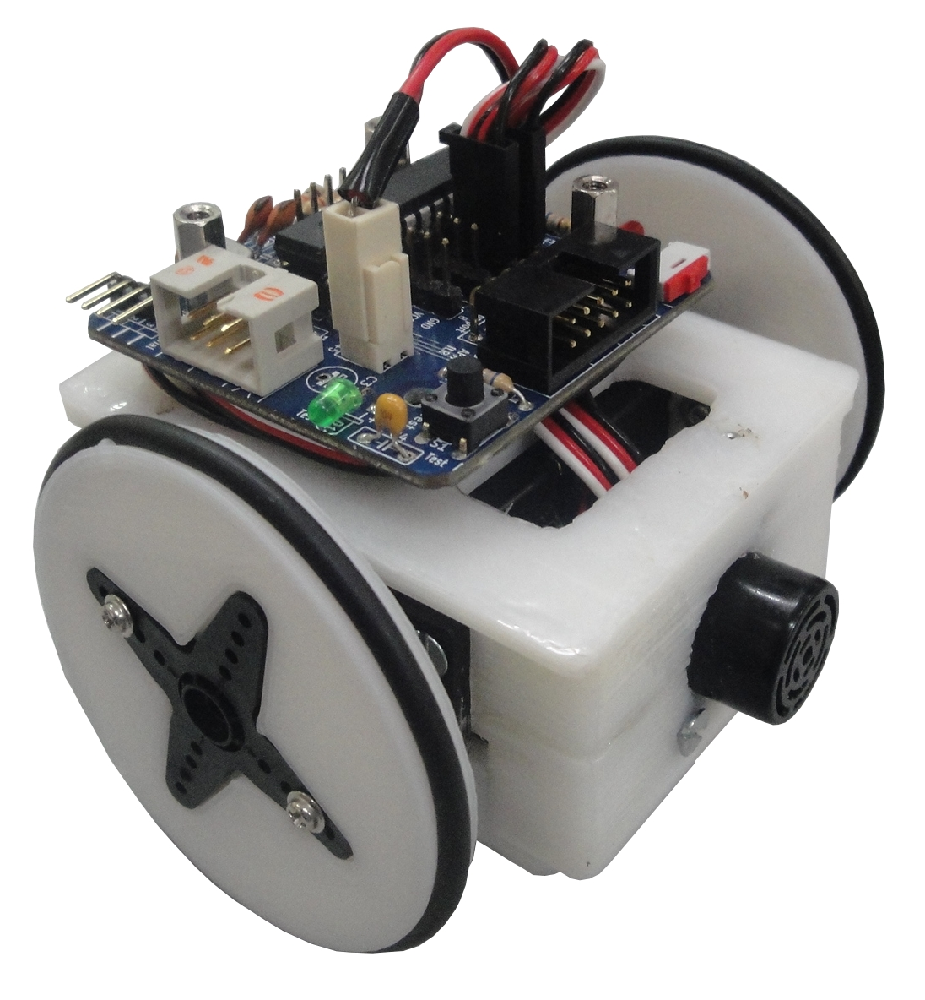

Miniskybot V2
===============

An open source 3D printable mobile robot ( **printbot** )

In this repository you can find the Miniskybot 2 or later
You can find more information (in spanish) in [this page](http://www.iearobotics.com/wiki/index.php?title=Miniskybot_2)

Features
--------
* Simplified chassis
* Marbel as cator wheel (thanks to sliptonic)
* Battery holder screwed to the chassis
* Compact and small
* 3 type of wheels, for the 3 different servo horns
* Electronics Compatible with [skymega](http://www.thingiverse.com/thing:14197) and [Arduino UNO](http://arduino.cc/en/Main/arduinoBoardUno) boards
  
License
=======

GPL license or Creative Commons Attribution-shareAlike  (Copyleft)

Authors
=======
* Juan Gonzalez-Gomez
* Andres Prieto-Moreno
* Miguel Angel de Frutos
* Antonio Barrientos

Credits
=======
* Alberto Valero
* Mohamed Abderrahim
* Sliptonic (for the Ball caster, derived from http://www.thingiverse.com/thing:13782)

Miniskybot V1
===========

For the miniskybot 1 go to the following links:

* http://www.iearobotics.com/wiki/index.php?title=Mini-Skybot_v1.0 (spanish)
* Thingiverse: http://www.thingiverse.com/thing:7989
* SVN repo: http://svn.iearobotics.com/Mini_Skybot/v1.0/

